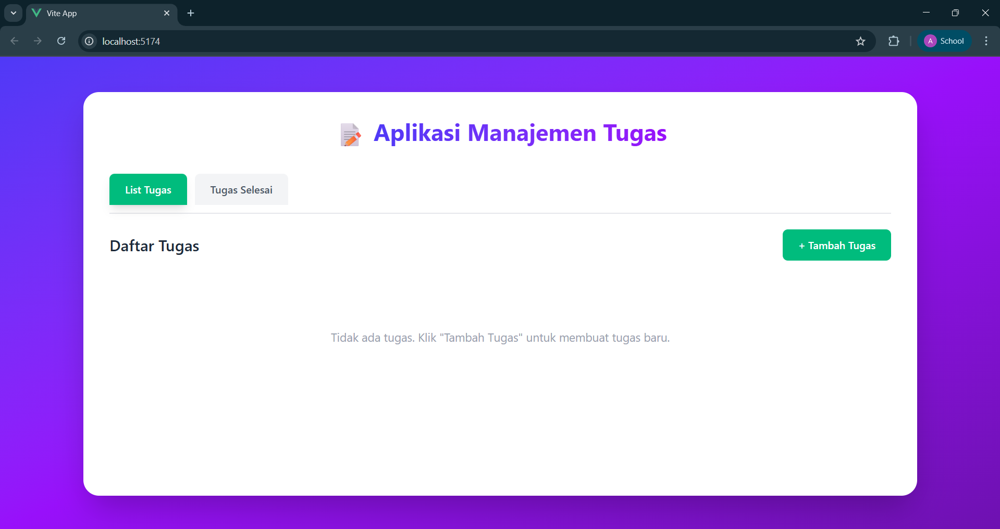
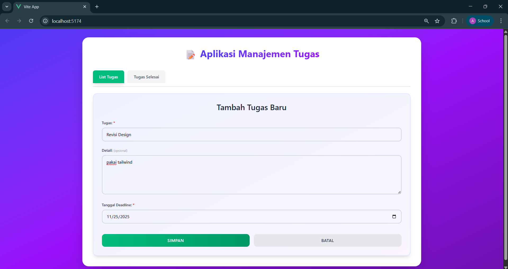
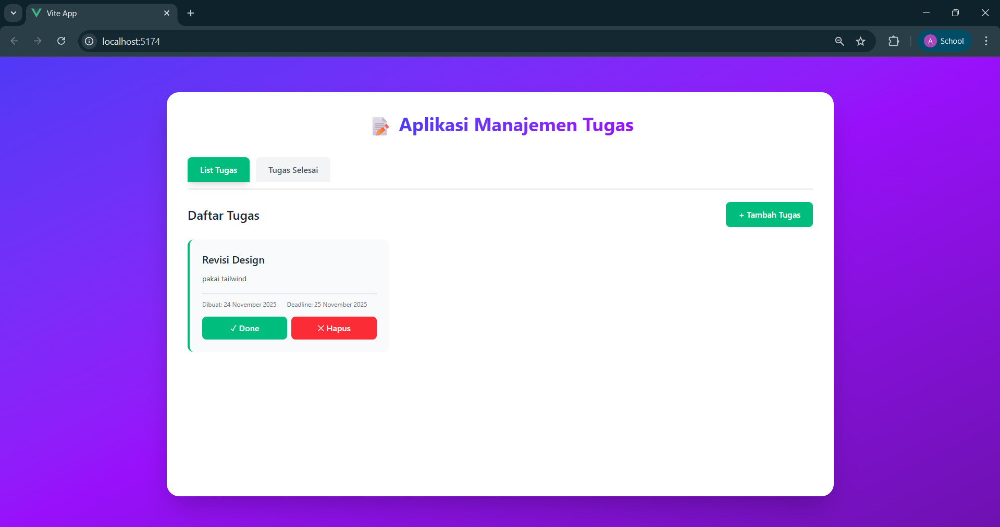
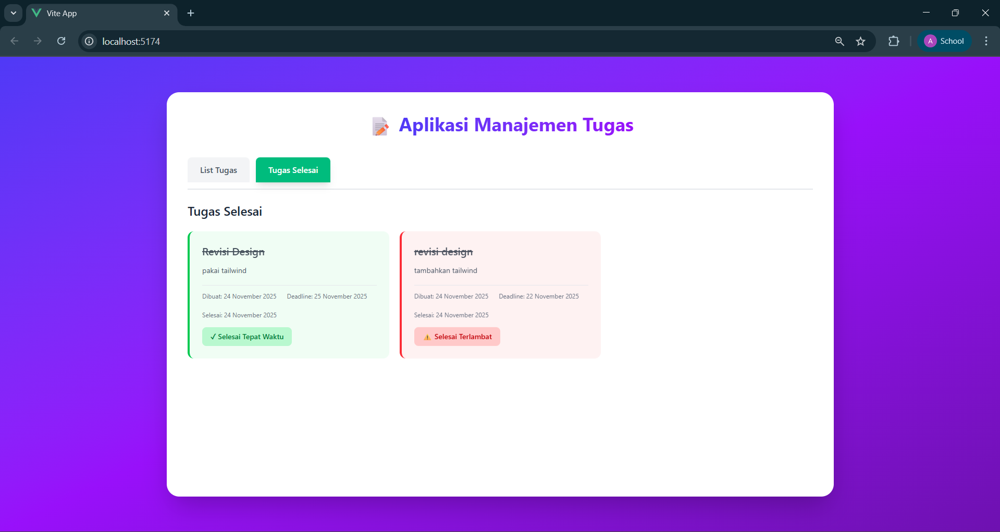

# Assignment: Vue.js – Aplikasi Manajemen Tugas

## Identitas

- **Nama**: Abdul Wafa
- **NIM**: F1D022104
- **Mata Kuliah**: Pemrograman Web Lanjut B
- **Minggu**: 12

---

## Deskripsi Tugas

Pada tugas ini saya membuat **Aplikasi Manajemen Tugas** yang lebih kompleks menggunakan **Vue 3**, **TypeScript**, **Pinia**, dan **Tailwind CSS**.

### Fitur Aplikasi:

1. **Navbar dengan 2 Tab**

   - Tab "List Tugas" untuk tugas aktif
   - Tab "Tugas Selesai" untuk tugas yang sudah diselesaikan

2. **Manajemen Tugas**

   - Menambah tugas dengan form lengkap (judul, detail opsional, deadline)
   - Menandai tugas sebagai selesai dengan tombol "Done"
   - Menghapus tugas dengan konfirmasi
   - Tanggal dibuat otomatis di-generate saat tugas ditambahkan

3. **Evaluasi Deadline**

   - Tugas yang selesai **sebelum/tepat deadline** → Background **hijau**
   - Tugas yang selesai **melewati deadline** → Background **merah**
   - Badge status untuk memberikan feedback visual

4. **State Management**

   - Menggunakan **Pinia** untuk state management terpusat
   - Data terstruktur dengan **TypeScript interface**
   - Reaktifitas otomatis untuk update UI

5. **Modern UI/UX**
   - Fullscreen layout dengan background gradient ungu
   - Styling dengan **Tailwind CSS**
   - Responsive design
   - Smooth transitions dan hover effects

---

## Teknologi yang Digunakan

- **Vue 3** dengan Composition API
- **TypeScript** untuk type safety
- **Pinia** untuk state management
- **Tailwind CSS** untuk styling
- **Vite** sebagai build tool

---

## Hasil

### 1. Screenshot Hasil Program

#### Tampilan List Tugas (Kosong)


_Tampilan awal ketika belum ada tugas. Menampilkan pesan "Tidak ada tugas. Klik 'Tambah Tugas' untuk membuat tugas baru."_

#### Form Tambah Tugas


_Form input dengan field:_

- _Tugas (required): Judul tugas_
- _Detail (optional): Deskripsi tugas_
- _Tanggal Deadline (required): Batas waktu penyelesaian_

#### List Tugas Aktif


_Menampilkan tugas yang masih aktif dengan informasi:_

- _Judul dan detail tugas_
- _Tanggal dibuat dan deadline_
- _Tombol "Done" untuk menyelesaikan_
- _Tombol "Hapus" untuk menghapus tugas_

#### Tugas Selesai (Tepat Waktu & Terlambat)


_Menampilkan tugas yang sudah diselesaikan dengan color coding:_

- _Background hijau + badge "✓ Selesai Tepat Waktu" untuk tugas yang diselesaikan sebelum/pada deadline_
- _Background merah + badge "⚠ Selesai Terlambat" untuk tugas yang diselesaikan melewati deadline_

---

### 2. Penjelasan Singkat

#### A. State Management dengan Pinia (`stores/todo.ts`)

**Interface Todo:**

```typescript
export interface Todo {
	id: number; // ID unik untuk setiap tugas
	title: string; // Judul tugas (required)
	detail: string; // Detail tugas (optional)
	deadline: string; // Tanggal deadline
	createdAt: string; // Tanggal dibuat (auto-generated)
	completed: boolean; // Status selesai
	completedAt?: string; // Tanggal selesai (optional)
}
```

**Fungsi `addTodo()`:**

```typescript
function addTodo(title: string, detail: string, deadline: string) {
	const newTodo: Todo = {
		id: Date.now(),
		title,
		detail,
		deadline,
		createdAt: new Date().toISOString(),
		completed: false,
	};
	todos.value.push(newTodo);
}
```

- Menerima input dari form (title, detail, deadline)
- Generate ID unik menggunakan `Date.now()`
- Generate tanggal dibuat otomatis dengan `new Date().toISOString()`
- Menambahkan todo baru ke dalam array `todos`
- Vue secara otomatis akan me-render ulang UI karena reaktifitas Pinia

**Fungsi `completeTodo()`:**

```typescript
function completeTodo(id: number) {
	const todo = todos.value.find((t) => t.id === id);
	if (todo) {
		todo.completed = true;
		todo.completedAt = new Date().toISOString();
	}
}
```

- Mencari todo berdasarkan ID
- Mengubah status `completed` menjadi `true`
- Mencatat waktu penyelesaian di `completedAt`
- Digunakan untuk evaluasi deadline (tepat waktu vs terlambat)

**Computed Properties:**

```typescript
const getActiveTodos = computed(() =>
	todos.value.filter((todo) => !todo.completed)
);

const getCompletedTodos = computed(() =>
	todos.value.filter((todo) => todo.completed)
);
```

- Memfilter tugas aktif dan selesai secara otomatis
- Computed property akan update otomatis saat data berubah

---

#### B. Komponen Navbar (`TodoNavbar.vue`)

```vue
<template>
	<div class="flex gap-2">
		<button
			@click="changeTab('active')"
			:class="activeTab === 'active' ? 'bg-emerald-500' : 'bg-gray-100'"
		>
			List Tugas
		</button>
		<button
			@click="changeTab('completed')"
			:class="activeTab === 'completed' ? 'bg-emerald-500' : 'bg-gray-100'"
		>
			Tugas Selesai
		</button>
	</div>
</template>
```

- Menggunakan `emit` untuk komunikasi dengan parent component
- Conditional class binding untuk active state
- Tailwind CSS untuk styling responsif

---

#### C. Menampilkan Data dengan `v-for` (`TodoList.vue`)

```vue
<div v-for="todo in activeTodos" :key="todo.id"
     class="bg-white border-l-4 border-emerald-500">
  <h3 class="font-bold">{{ todo.title }}</h3>
  <p class="text-gray-600">{{ todo.detail || 'Tidak ada detail' }}</p>

  <div class="text-sm text-gray-500">
    <div>📅 Dibuat: {{ formatDate(todo.createdAt) }}</div>
    <div>⏰ Deadline: {{ formatDate(todo.deadline) }}</div>
  </div>

  <div class="flex gap-2">
    <button @click="handleComplete(todo.id)">✓ Done</button>
    <button @click="handleDelete(todo.id)">✕ Hapus</button>
  </div>
</div>
```

- `v-for` untuk looping setiap todo dalam array
- `:key="todo.id"` untuk tracking perubahan (best practice Vue)
- Menampilkan title, detail, tanggal dengan interpolation `{{ }}`
- Event handler `@click` untuk tombol Done dan Hapus

---

#### D. Cara Kerja Tombol Hapus

```vue
<script setup lang="ts">
const handleDelete = (id: number) => {
	if (confirm("Yakin ingin menghapus tugas ini?")) {
		todoStore.deleteTodo(id);
	}
};
</script>
```

- Menampilkan konfirmasi sebelum menghapus dengan `confirm()`
- Memanggil fungsi `deleteTodo()` dari Pinia store
- Todo akan dihapus dari array dan UI update otomatis

**Di Pinia store:**

```typescript
function deleteTodo(id: number) {
	const index = todos.value.findIndex((t) => t.id === id);
	if (index !== -1) {
		todos.value.splice(index, 1);
	}
}
```

- Mencari index todo berdasarkan ID
- Menghapus dari array dengan `splice()`
- Reaktifitas Vue akan update UI secara otomatis

---

#### E. Evaluasi Deadline dengan Color Coding (`CompletedTodos.vue`)

```vue
<div v-for="todo in completedTodos" :key="todo.id"
     :class="getStatusClass(todo)">
  <!-- ... -->
  <div :class="getStatusBadgeClass(todo)">
    {{ getStatusText(todo) }}
  </div>
</div>

<script setup lang="ts">
const getStatusClass = (todo: Todo) => {
  const deadline = new Date(todo.deadline);
  const completed = new Date(todo.completedAt!);

  return completed <= deadline
    ? 'bg-green-50 border-green-500'  // Tepat waktu
    : 'bg-red-50 border-red-500';     // Terlambat
};

const getStatusText = (todo: Todo) => {
  const deadline = new Date(todo.deadline);
  const completed = new Date(todo.completedAt!);

  return completed <= deadline
    ? '✓ Selesai Tepat Waktu'
    : '⚠ Selesai Terlambat';
};
</script>
```

- Membandingkan tanggal selesai (`completedAt`) dengan deadline
- Jika selesai ≤ deadline → hijau
- Jika selesai > deadline → merah
- Badge dinamis sesuai dengan status

---

## Struktur Folder

```
src/
├── components/
│   ├── TodoNavbar.vue      # Navbar dengan 2 tab
│   ├── TodoList.vue        # Daftar tugas aktif
│   ├── AddTodoForm.vue     # Form tambah tugas
│   └── CompletedTodos.vue  # Daftar tugas selesai
├── stores/
│   └── todo.ts             # Pinia store (state management)
├── assets/
│   └── main.css            # Tailwind CSS import
├── App.vue                 # Komponen root
└── main.ts                 # Entry point aplikasi
```

---

## Cara Menjalankan

```bash
# Install dependencies
npm install

# Run development server
npm run dev

# Build for production
npm run build
```

Aplikasi akan berjalan di `http://localhost:5174/`

---

**© 2025 - Abdul Wafa (F1D022104)**  
Pemrograman Web Lanjut B - Week 12
